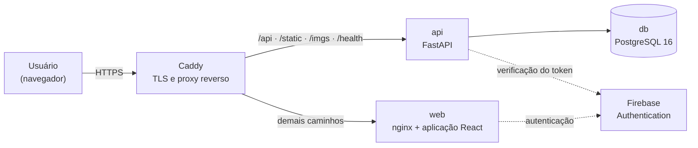
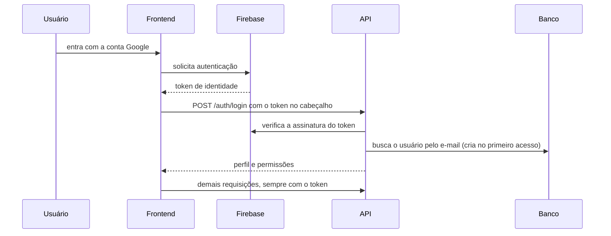
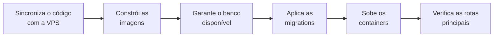

# Arquitetura do Sistema

Esta página descreve como o IFVest está construído: os componentes que formam a plataforma, como se comunicam, onde estão hospedados e como são entregues em produção.

!!! info "Fonte desta descrição"
    O conteúdo foi levantado diretamente do **repositório em produção** (`ifvest-monorepo`) — código-fonte, configurações de infraestrutura e pipeline de implantação. Onde a documentação de apoio da equipe diverge do código, **o código foi adotado**, conforme o [critério de evidência](planejamento.md#criterio-de-evidencia) desta documentação.

---

## Visão geral

O IFVest é uma aplicação web composta por um **frontend de página única** e uma **API REST**, mantidos no mesmo repositório (monorepo) e publicados sob um **único domínio**.



| Componente | Tecnologia | Papel |
|---|---|---|
| **Frontend** | React + TypeScript, construído com Vite | Interface do usuário, executada no navegador |
| **Backend** | Python + FastAPI | API REST com as regras de negócio |
| **Banco de dados** | PostgreSQL 16 | Persistência de todos os dados da plataforma |
| **Autenticação** | Firebase Authentication | Identidade dos usuários e emissão de tokens |
| **Proxy reverso** | Caddy | Certificado TLS e roteamento das requisições |

O repositório é organizado em duas aplicações independentes, cada uma com seus próprios testes, dependências e imagem de container, ao lado da infraestrutura e da documentação da equipe:

```text
ifvest-monorepo/
├── ifvest-backend/      # API FastAPI, modelos, serviços e migrations
├── ifvest-frontend/     # aplicação React
├── deploy/              # infraestrutura de produção
├── docs/                # guias da equipe, registros de decisão e auditorias
├── scripts/             # verificação de qualidade manual, em PowerShell
├── .github/workflows/   # integração contínua e implantação
└── .githooks/           # validações executadas antes de cada push
```

---

## Topologia de produção

A plataforma roda em uma **VPS única**, com quatro containers orquestrados por Docker Compose:

| Serviço | Imagem | Porta publicada | Função |
|---|---|---|---|
| `caddy` | Caddy 2 | **80 e 443** | Recebe todo o tráfego externo, emite o certificado TLS e distribui as requisições |
| `web` | nginx | nenhuma | Serve os arquivos estáticos da aplicação React |
| `api` | Python 3.12 | nenhuma | Executa a API FastAPI |
| `db` | PostgreSQL 16 | nenhuma | Banco de dados |

**Apenas o Caddy é acessível de fora.** Frontend, API e banco existem somente na rede interna do Compose — o banco de dados, em particular, não tem nenhuma porta exposta à internet.

O que precisa sobreviver à troca de versão fica em volumes do Docker: os dados do banco, as imagens das questões e os certificados emitidos pelo Caddy.

### Roteamento por caminho

Como frontend e API compartilham o mesmo domínio, o Caddy decide o destino de cada requisição pelo início do caminho:

| Caminho | Destino |
|---|---|
| `/api/*` | API — endpoints da aplicação |
| `/static/*` e `/imgs/*` | API — arquivos e imagens servidos pelo backend |
| `/health` | API — verificação de disponibilidade |
| qualquer outro | Frontend — a aplicação React assume o roteamento |

Estando tudo na mesma origem, **o navegador não precisa de CORS**: o frontend chama a API por caminhos relativos. A lista de origens permitidas continua configurada no backend como camada adicional de proteção: em produção, o próprio domínio, além dos endereços locais (`localhost`), que o código libera sempre, para o desenvolvimento.

O domínio de produção é **`ifvest.com.br`**, com certificado Let's Encrypt emitido e renovado automaticamente pelo Caddy. O endereço `www` redireciona permanentemente para o domínio principal.

---

## Backend

### Tecnologias

| Tecnologia | Versão mínima | Função |
|---|---|---|
| Python | 3.12 | Linguagem |
| FastAPI | 0.115 | Framework da API |
| Uvicorn | 0.32 | Servidor ASGI |
| SQLAlchemy | 2.0 | ORM, em modo assíncrono |
| asyncpg | 0.30 | Driver assíncrono do PostgreSQL |
| Alembic | 1.14 | Migrations do banco de dados |
| Pydantic | 2.10 | Validação de dados e esquemas da API |
| pydantic-settings | 2.7 | Configuração por variáveis de ambiente |
| firebase-admin | 6.5 | Verificação dos tokens de autenticação |

### Organização

```text
ifvest-backend/src/
├── api/v1/       # rotas: auth, users, features, question_bank, mocktests, essays, quiz, admin
├── core/         # segurança, Firebase, catálogo de permissões, guarda dos módulos, paginação
├── models/       # modelos de dados (SQLAlchemy)
├── schemas/      # contratos de entrada e saída da API (Pydantic)
├── services/     # regras de negócio de cada módulo
└── scripts/      # rotinas auxiliares, como a carga de provas
```

O código segue uma **separação em camadas**: as rotas recebem e validam a requisição, os serviços aplicam as regras de negócio e os modelos representam as tabelas. As rotas dos módulos delegam aos serviços o acesso ao banco; as de sessão e de usuários, mais simples, e alguns trechos das rotas do quiz consultam o banco diretamente.

Toda a comunicação com o banco é **assíncrona**, o que permite à API atender várias requisições simultâneas sem bloquear enquanto aguarda o banco de dados.

---

## Frontend

### Tecnologias

| Tecnologia | Versão | Função |
|---|---|---|
| React | 19 | Biblioteca de interface |
| TypeScript | 5.7 | Linguagem, com tipagem estática |
| Vite | 6 | Ferramenta de build e servidor de desenvolvimento |
| React Router | 7 | Roteamento entre telas |
| Firebase SDK | 12 | Autenticação no navegador |

### Organização

```text
ifvest-frontend/src/
├── core/                  # infraestrutura compartilhada
│   ├── api/               # cliente HTTP de acesso à API, com leitura da paginação
│   ├── auth/              # sessão, integração com o Firebase e nomes das permissões
│   ├── features/          # leitura e aplicação das feature flags
│   ├── hooks/             # hooks reutilizáveis
│   ├── layout/            # estrutura visual comum às telas
│   └── types/             # tipos compartilhados
├── features/              # uma pasta por módulo
│   ├── auth/  home/  quiz/  essays/  mocktests/
│   ├── professor/         # área do professor
│   ├── admin/             # painel administrativo
│   └── underDevelopment/  # tela exibida para módulos ainda desativados
└── router/                # definição das rotas da aplicação
```

A organização é **por funcionalidade**: cada módulo da plataforma tem sua própria pasta, com telas, componentes e testes, enquanto `core/` concentra o que é compartilhado.

Duas áreas reúnem as tarefas de gestão:

- **Área do Professor** — banco de questões, propostas de redação e fila de correção. Aparece para quem tem ao menos uma das permissões de conteúdo ou de redação.
- **Painel Administrativo** — visão geral com indicadores, usuários e permissões, moderação das denúncias de questões e controle dos módulos. Restrito à permissão de administrador.

Em produção, o frontend é compilado em arquivos estáticos e servido pelo nginx. Não há renderização no servidor: toda a interface é montada no navegador.

---

## Autenticação e autorização

A plataforma separa duas responsabilidades: **quem é o usuário** fica com o Firebase; **o que ele pode fazer** fica com o backend.



O backend **nunca recebe a senha do usuário**. Ele recebe apenas o token emitido pelo Firebase, verifica sua autenticidade com o SDK administrativo e, a partir do e-mail contido nele, carrega as permissões do usuário no banco.

O login é feito **com a conta Google**, único método oferecido pela aplicação web. No primeiro acesso, a chamada a `/auth/login` cria o registro do usuário e atribui as permissões iniciais; até lá, as demais rotas protegidas respondem que o usuário não existe.

O frontend não bloqueia telas por falta de sessão: quem abre uma tela sem ter entrado não recebe os dados, porque a API recusa as chamadas às rotas protegidas.

!!! note "Divergência: métodos de login"
    O README do backend descreve login por e-mail e senha além do Google. O código implementa apenas o Google: não há tela de cadastro nem de entrada por e-mail e senha. O backend aceita qualquer token do Firebase que contenha um e-mail, então os dois métodos continuariam compatíveis do lado da API. Esta página adota o estado verificado no código.

### Permissões

A autorização é feita por **permissões granulares**, sem papéis fixos. O catálogo atual tem sete permissões:

| Permissão | Autoriza |
|---|---|
| `admin_permission` | Administração da plataforma: painel, permissões e módulos. Quem a tem passa em todas as verificações |
| `create_question` | Cadastrar questões no banco |
| `edit_question` | Editar questões existentes: enunciado, alternativas, gabarito e taxonomia |
| `create_mocktest` | Criar simulados a partir do banco de questões |
| `manage_mocktests` | Editar e excluir simulados criados por outras pessoas |
| `create_essay_proposal_permission` | Criar e editar propostas de redação |
| `grade_essay_permission` | Corrigir redações |

O catálogo fica num único arquivo do backend, lido pelas rotas, pelas permissões iniciais e pela lista oferecida no painel administrativo. A concessão recusa nomes que não estão nele.

As permissões iniciais são atribuídas no primeiro acesso, conforme o e-mail do usuário:

| E-mail | Permissões atribuídas |
|---|---|
| Administrador inicial, definido na configuração | Todas as sete |
| Domínio `@ifsp.edu.br` | As quatro de conteúdo: cadastrar e editar questões, criar simulados e gerenciar os simulados de outras pessoas |
| Dois endereços fixos, os mesmos das contas de teste | As quatro de conteúdo, mais as de correção e de propostas de redação (ver [Pontos de atenção](#pontos-de-atencao)) |
| Demais | Nenhuma permissão especial |

As permissões iniciais valem **só na criação da conta**: as concessões e revogações feitas depois por um administrador permanecem nos acessos seguintes. A permissão de administrador do administrador inicial não pode ser revogada, e toda concessão e revogação fica no registro de auditoria.

Quando falta uma permissão, a API recusa a chamada informando **qual permissão está faltando** e orientando a procurar um administrador.

### Ambiente de desenvolvimento

Para desenvolver sem depender do Firebase, o backend aceita **tokens simulados** que representam perfis de teste — estudante, professor, corretor e administrador. O mecanismo só funciona com a opção ligada e fora do ambiente de produção: a configuração de implantação define o ambiente como produção, e nele o código ignora os tokens simulados mesmo que a opção seja ativada por engano.

---

## Feature flags

Os módulos da plataforma são ligados e desligados por **feature flags**, sem necessidade de alterar código ou refazer a implantação.

| Módulo | Funcionalidades controladas separadamente |
|---|---|
| **IFQuiz** | Pergunta do dia, ranking, loja de avatares, criação de quiz personalizado |
| **Redação** | Correção de redações, criação de propostas |
| **Simulados** | Simulado aleatório, exportação em PDF |
| **Cadastro de questões** | — *(flag própria: o banco de questões é compartilhado pelos Simulados e pelo IFQuiz)* |
| **Flashcards** | — *(em construção)* |
| **Revisão** | — *(em construção)* |
| **Administração** | — |

As flags obedecem a uma **hierarquia**: desligar um módulo desliga automaticamente todas as suas funcionalidades. O estado de cada flag pode vir do banco de dados, quando alterado pelo painel administrativo, ou do valor padrão, definido por variável de ambiente. Sem alteração, valem os padrões do código: todos os módulos ligados, exceto Flashcards e Revisão. Toda alteração feita pelo painel fica no registro de auditoria.

O controle é aplicado **nas duas pontas**: o backend recusa, com o código 503, as chamadas a módulos e funcionalidades desligados, e o frontend oculta as telas correspondentes, exibindo uma página de "em desenvolvimento" no lugar. Há duas exceções:

- o **painel administrativo** é controlado só pelo frontend — as rotas de administração não consultam a flag e continuam exigindo a permissão de administrador;
- **Flashcards** e **Revisão** ainda não têm rotas na API.

Nas rotas de um módulo, a verificação do módulo vem **antes de tudo**: um módulo desligado responde 503 antes mesmo de identificar o usuário. Depois vêm a identificação, a permissão exigida e, por último, a flag da funcionalidade específica, quando houver.

Se a consulta às flags falhar, o frontend **não presume que os módulos estão ligados**: no lugar do módulo, exibe um aviso com a opção de tentar de novo.

!!! note "O que está ligado em produção"
    O código define quais flags existem e seus valores padrão; **quais estão ativas é estado da produção**, configurado no banco e no ambiente. A lista acima descreve o que a plataforma é capaz de controlar, não o que está disponível neste momento. ⬜ *A registrar o estado em produção: a consulta pública `/api/v1/features` informa, para cada flag, se está ligada e se o valor vem do banco ou do padrão.*

---

## Dados

O banco de dados tem **24 tabelas e 30 chaves estrangeiras**, organizadas em oito domínios:

| Domínio | Tabelas |
|---|---|
| Usuários e permissões | `users`, `permissions`, `user_permissions` |
| Taxonomia | `disciplines`, `subjects`, `topics` |
| Banco de questões | `multiple_choice_questions`, `alternatives`, `question_topics` |
| Simulados | `fixed_mocktests`, `questions_mocktests`, `user_mocktests` |
| Quiz e gamificação | `quiz_history`, `question_history`, `items`, `transactions` |
| Redação | `proposals`, `support_texts`, `essays`, `gradings`, `essay_annotations` |
| Moderação e auditoria | `question_reports`, `audit_logs` |
| Plataforma | `feature_flags` |

O diagrama completo, com colunas e relacionamentos por domínio, está em **[Modelo de Dados](modelo-de-dados.md)**.

### Armazenamento de arquivos

A plataforma usa **duas estratégias** para arquivos:

- **Imagens das questões** são gravadas como arquivos em um volume persistente e servidas pela API em `/static` e `/imgs`.
- **Fotos de perfil** e **imagens dos textos de apoio** das propostas de redação são gravadas **dentro do banco**, como dados binários.

O armazenamento no banco simplifica a implantação, mas aumenta o tamanho do banco e dos backups conforme o volume de imagens cresce.

### Carga do banco de questões

As provas entram no banco por um **script de carga executado na VPS**. Ele lê os arquivos JSON das provas da UNICAMP, mantidos fora do repositório, importa só as questões objetivas e copia as imagens para o volume da API.

A carga é **segura para repetir**: uma questão é identificada por banca, ano, número e tipo, e as que já existem são puladas. Pelo mesmo motivo, ela só insere — correções em questões já importadas são feitas pela edição de questões, a partir das denúncias recebidas na moderação.

### Migrations

A estrutura do banco é controlada pelo **Alembic**. Cada alteração nos modelos gera uma migration versionada, aplicada automaticamente na implantação. Atualmente há sete:

| Migration | Alteração |
|---|---|
| Schema inicial | Criação das tabelas da plataforma |
| Feature flags | Tabela de controle dos módulos |
| Tags e títulos | Tags nas propostas de redação e título nos textos de apoio |
| Denúncias e auditoria | Tabelas de denúncias de questões e de registro de auditoria |
| Datas sem fuso horário | Alinha as datas das duas tabelas anteriores ao padrão das demais |
| Divisão das permissões de conteúdo | Cria as quatro permissões de conteúdo e dá a cada usuário as equivalentes das que já tinha |
| Remoção das permissões antigas | Remove as duas permissões genéricas que foram divididas |

As duas últimas seguem o padrão **expandir e contrair**: a primeira só acrescenta, para que a versão anterior da API continue funcionando durante a implantação; a segunda, aplicada numa implantação seguinte, remove o que deixou de ser usado.

Em produção, a criação automática de tabelas fica **desligada de propósito**: com ela ativa, uma migration esquecida passaria despercebida, porque a tabela seria criada de qualquer forma. A integração contínua confere, num PostgreSQL real, que as migrations sobem e descem sem erro e que o resultado corresponde aos modelos.

---

## API

A API segue o padrão **REST**, com troca de dados em JSON, e está versionada sob o prefixo `/api/v1`. Ela expõe **60 rotas**, contando cada combinação de método e caminho:

| Grupo | Rotas | Cobre |
|---|---|---|
| `quiz` | 18 | Partidas, pergunta do dia, filtros de montagem, ranking, loja e histórico |
| `mocktests` | 12 | Montagem, resolução e correção de simulados, exportação em PDF, histórico e estatísticas |
| `essays` | 11 | Propostas, redações e correções |
| `users` | 6 | Perfil do usuário, lista de usuários e permissões |
| `question-bank` | 5 | Busca, cadastro e edição de questões, e denúncias |
| `features` | 3 | Consulta e alteração das feature flags |
| `admin` | 3 | Painel de indicadores e moderação das denúncias |
| `auth` | 2 | Sessão do usuário |

A especificação completa, com todos os parâmetros e respostas, está em **[Referência da API](api.md)**.

!!! note "A documentação interativa da API não é pública em produção"
    O FastAPI gera automaticamente uma interface interativa da API, mas em produção ela está **fechada de propósito**: as rotas de documentação não são encaminhadas ao backend. A especificação publicada nesta documentação foi gerada a partir do código-fonte, sem expor o ambiente de produção.

---

## Qualidade e testes

| | Backend | Frontend |
|---|---|---|
| **Testes** | pytest, com cobertura mínima de **90%**, contando os ramos | Vitest, com cobertura mínima de **90%** em linhas, ramos, funções e instruções |
| **Análise estática** | Ruff (lint e formatação) | ESLint e verificação de tipos do TypeScript |
| **Complexidade** | Complexidade ciclomática máxima 9 por função | Complexidade cognitiva máxima 9 (plugin SonarJS) |
| **Mutação** | mutmut, nos módulos de regra de negócio | Stryker |

Os testes **de ponta a ponta**, com Playwright, percorrem as jornadas da plataforma num navegador real, com backend e frontend rodando juntos sobre PostgreSQL.

### Integração contínua

Os workflows ficam em `.github/workflows/`, na raiz do monorepo, e rodam a cada pull request e a cada push na `main` que altere o backend ou o frontend:

| Workflow | Verifica |
|---|---|
| CI — Backend | Lint, formatação, testes com cobertura, migrations e compatibilidade com PostgreSQL, e o build da imagem |
| CI — Frontend | Lint, testes com cobertura, build da aplicação e da imagem |
| E2E — Playwright | Jornadas de ponta a ponta sobre PostgreSQL |
| Mutation Testing | Testes de mutação; por serem lentos, rodam toda segunda-feira e sob demanda, fora dos pull requests |

### Validação antes do push

O repositório inclui um **hook de pre-push** que identifica quais aplicações foram alteradas e executa apenas as validações correspondentes — lint e testes do backend, ou tipos, lint e testes do frontend. O push é bloqueado se alguma falhar. A cobertura mínima é conferida só na integração contínua, para manter o push rápido.

O hook é ativado automaticamente quando se roda `npm install` no frontend. Quem trabalha só no backend precisa ativá-lo uma vez, com `git config core.hooksPath .githooks`.

---

## Implantação

A implantação é feita por um **workflow do GitHub Actions**, disparado manualmente por decisão da equipe, que permite atualizar a plataforma inteira ou apenas o frontend ou o backend.



A ordem é deliberada: **as migrations são aplicadas antes da nova versão subir**. Se uma migration falhar, a implantação é interrompida e a versão anterior continua no ar — a plataforma nunca fica rodando código novo contra um banco desatualizado.

Ao final, o workflow confere se a página inicial, a verificação de disponibilidade e a consulta de feature flags respondem com sucesso, e marca a implantação como falha caso contrário.

---

## Operação e segurança

| Aspecto | Configuração |
|---|---|
| **Backup** | Cópia completa do banco diariamente às 3h, com retenção de 14 dias e procedimento de restauração documentado |
| **Firewall** | Apenas as portas 22 (SSH), 80 e 443 aceitam conexões |
| **Acesso ao servidor** | Somente por chave SSH, com bloqueio automático por uma hora após cinco tentativas falhas em dez minutos |
| **Cabeçalhos HTTP** | HSTS, bloqueio de incorporação em outros sites, proteção contra interpretação indevida de conteúdo, política de referência restrita e ocultação da identificação do servidor |
| **Credenciais** | Arquivos de configuração e credenciais do Firebase existem apenas no servidor e nunca são sincronizados pela implantação |
| **Logs** | Rotação automática dos logs dos containers e do acesso ao Caddy |

---

## Pontos de atenção

Itens identificados na análise do repositório, relevantes para a evolução da plataforma:

| Ponto | Situação |
|---|---|
| ⬜ **Verificações não obrigatórias** | A integração contínua só impede a entrada de código na `main` se a proteção da branch estiver configurada no GitHub, o que depende do plano da organização. No levantamento da equipe de 27/09/2026, essa proteção ainda não havia sido confirmada; sem ela, os resultados funcionam como aviso, e o hook de pre-push pode ser pulado. |
| ⬜ **Sem limite de requisições** | Nenhum endpoint tem limite de taxa, o que deixa a API exposta a uso abusivo — inclusive o envio de redações, que não tem limite por usuário. Pendência já registrada pela equipe. |
| ⬜ **Permissões atribuídas a e-mails fixos** | A lógica de permissões iniciais concede a dois endereços fixos, os mesmos das contas de teste, as permissões de correção e de propostas de redação, além das quatro de conteúdo. Como a regra vale também em produção, uma conta com um desses e-mails as receberia no primeiro acesso. |
| ⬜ **Painel administrativo pode se trancar** | Desligar o módulo Administração pelo próprio painel esconde o painel — inclusive a aba em que ele seria religado —, porque essa flag é verificada só no frontend. A volta só é possível pela API (`/api/v1/features/module_admin`) ou pelo banco. |
| ⬜ **Origem das provas e extrator de questões por IA** | O banco é alimentado pela carga de provas da UNICAMP a partir de arquivos JSON mantidos fora do repositório. O repositório não registra quem gera esses arquivos nem como o extrator de questões por IA vai se integrar à plataforma. |

---

## Fontes desta página

| Conteúdo | Fonte | Data |
|---|---|---|
| Stack, organização e dependências | Código-fonte do `ifvest-monorepo` (`requirements.txt`, `package.json`, estrutura de `src/`) | set/2026 |
| Topologia, roteamento, segurança e backup | Configuração de produção (`deploy/docker-compose.prod.yml`, `deploy/Caddyfile`, `deploy/README.md`) | set/2026 |
| Autenticação e permissões | `src/core/security.py`, `firebase.py`, `permissions.py` e `permission_catalog.py`; `ifvest-frontend/src/core/auth/` | set/2026 |
| Feature flags | `src/services/feature_flags_service.py`, `src/core/feature_guard.py`, `src/config.py` e `ifvest-frontend/src/core/features/` | set/2026 |
| Modelo de dados e migrations | Metadados dos modelos SQLAlchemy e migrations do Alembic, lidos diretamente do código | set/2026 |
| Carga do banco de questões | `docs/atualizar-questoes-na-vps.md` | set/2026 |
| API | Especificação OpenAPI gerada a partir do código-fonte | set/2026 |
| Qualidade e integração contínua | `.github/workflows/`, `.githooks/pre-push` e `docs/quality-gates-2026-09-27.md` | set/2026 |
| Implantação | Workflow `.github/workflows/cd.yml` | set/2026 |

!!! note "Divergência na documentação de implantação"
    A documentação de implantação do repositório registra, entre seus pontos em aberto, a ausência de migrations — mas o próprio repositório já contém as migrations do Alembic, e a seção anterior do mesmo documento descreve seu funcionamento. Menciona ainda um script de implantação que não está no repositório, substituído pelo workflow do GitHub Actions. Esta página adota o estado verificado no código.
