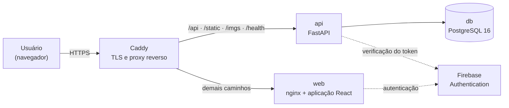
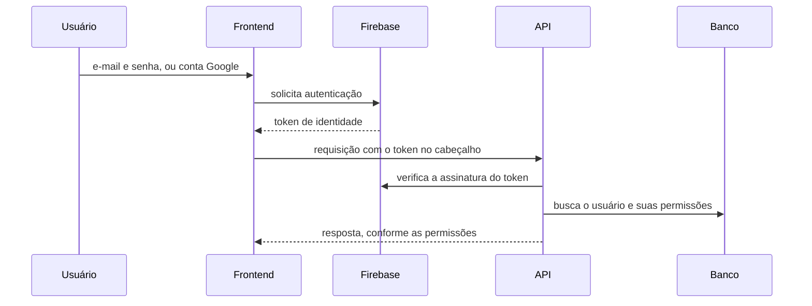
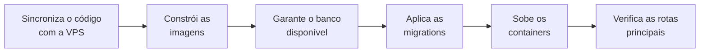

# Arquitetura do Sistema

Esta página descreve como o IFVest está construído: os componentes que formam a plataforma, como se comunicam, onde estão hospedados e como são entregues em produção.

!!! info "Fonte desta descrição"
    O conteúdo foi levantado diretamente do **repositório em produção** (`ifvest-monorepo`) — código-fonte, configurações de infraestrutura e pipeline de implantação. Onde a documentação de apoio da equipe diverge do código, **o código foi adotado**, conforme o [critério de evidência](planejamento.md#criterio-de-evidencia) desta documentação.

---

## Visão geral

O IFVest é uma aplicação web composta por um **frontend de página única** e uma **API REST**, mantidos no mesmo repositório (monorepo) e publicados sob um **único domínio**.



| Componente | Tecnologia | Papel |
|---|---|---|
| **Frontend** | React + TypeScript, construído com Vite | Interface do usuário, executada no navegador |
| **Backend** | Python + FastAPI | API REST com as regras de negócio |
| **Banco de dados** | PostgreSQL 16 | Persistência de todos os dados da plataforma |
| **Autenticação** | Firebase Authentication | Identidade dos usuários e emissão de tokens |
| **Proxy reverso** | Caddy | Certificado TLS e roteamento das requisições |

O repositório é organizado em duas aplicações independentes, cada uma com seus próprios testes, dependências e imagem de container:

```text
ifvest-monorepo/
├── ifvest-backend/      # API FastAPI, modelos, serviços e migrations
├── ifvest-frontend/     # aplicação React
├── deploy/              # infraestrutura de produção
└── .githooks/           # validações executadas antes de cada push
```

---

## Topologia de produção

A plataforma roda em uma **VPS única**, com quatro containers orquestrados por Docker Compose:

| Serviço | Imagem | Porta publicada | Função |
|---|---|---|---|
| `caddy` | Caddy 2 | **80 e 443** | Recebe todo o tráfego externo, emite o certificado TLS e distribui as requisições |
| `web` | nginx | nenhuma | Serve os arquivos estáticos da aplicação React |
| `api` | Python 3.12 | nenhuma | Executa a API FastAPI |
| `db` | PostgreSQL 16 | nenhuma | Banco de dados |

**Apenas o Caddy é acessível de fora.** Frontend, API e banco existem somente na rede interna do Compose — o banco de dados, em particular, não tem nenhuma porta exposta à internet.

### Roteamento por caminho

Como frontend e API compartilham o mesmo domínio, o Caddy decide o destino de cada requisição pelo início do caminho:

| Caminho | Destino |
|---|---|
| `/api/*` | API — endpoints da aplicação |
| `/static/*` e `/imgs/*` | API — arquivos e imagens servidos pelo backend |
| `/health` | API — verificação de disponibilidade |
| qualquer outro | Frontend — a aplicação React assume o roteamento |

Estando tudo na mesma origem, **o navegador não precisa de CORS**: o frontend chama a API por caminhos relativos. A lista de origens permitidas continua configurada no backend, restrita ao próprio domínio, como camada adicional de proteção.

O domínio de produção é **`ifvest.com.br`**, com certificado Let's Encrypt emitido e renovado automaticamente pelo Caddy. O endereço `www` redireciona permanentemente para o domínio principal.

---

## Backend

### Tecnologias

| Tecnologia | Versão mínima | Função |
|---|---|---|
| Python | 3.12 | Linguagem |
| FastAPI | 0.115 | Framework da API |
| Uvicorn | 0.32 | Servidor ASGI |
| SQLAlchemy | 2.0 | ORM, em modo assíncrono |
| asyncpg | 0.30 | Driver assíncrono do PostgreSQL |
| Alembic | 1.14 | Migrations do banco de dados |
| Pydantic | 2.10 | Validação de dados e esquemas da API |
| pydantic-settings | 2.7 | Configuração por variáveis de ambiente |
| firebase-admin | 6.5 | Verificação dos tokens de autenticação |

### Organização

```text
ifvest-backend/src/
├── api/v1/       # rotas: auth, users, quiz, mocktests, essays, features
├── core/         # segurança, Firebase, permissões, feature flags
├── models/       # modelos de dados (SQLAlchemy)
├── schemas/      # contratos de entrada e saída da API (Pydantic)
├── services/     # regras de negócio de cada módulo
└── scripts/      # rotinas auxiliares, como carga de dados
```

O código segue uma **separação em camadas**: as rotas recebem e validam a requisição, os serviços aplicam as regras de negócio e os modelos representam as tabelas. As rotas não acessam o banco diretamente.

Toda a comunicação com o banco é **assíncrona**, o que permite à API atender várias requisições simultâneas sem bloquear enquanto aguarda o banco de dados.

---

## Frontend

### Tecnologias

| Tecnologia | Versão | Função |
|---|---|---|
| React | 19 | Biblioteca de interface |
| TypeScript | 5.7 | Linguagem, com tipagem estática |
| Vite | 6 | Ferramenta de build e servidor de desenvolvimento |
| React Router | 7 | Roteamento entre telas |
| Firebase SDK | 12 | Autenticação no navegador |

### Organização

```text
ifvest-frontend/src/
├── core/                  # infraestrutura compartilhada
│   ├── api/               # cliente HTTP de acesso à API
│   ├── auth/              # sessão e integração com o Firebase
│   ├── features/          # leitura e aplicação das feature flags
│   ├── layout/            # estrutura visual comum às telas
│   └── types/             # tipos compartilhados
├── features/              # uma pasta por módulo
│   ├── auth/  home/  quiz/  essays/  mocktests/  admin/
│   └── underDevelopment/  # tela exibida para módulos ainda desativados
└── router/                # definição das rotas da aplicação
```

A organização é **por funcionalidade**: cada módulo da plataforma tem sua própria pasta, com telas, componentes e testes, enquanto `core/` concentra o que é compartilhado.

Em produção, o frontend é compilado em arquivos estáticos e servido pelo nginx. Não há renderização no servidor: toda a interface é montada no navegador.

---

## Autenticação e autorização

A plataforma separa duas responsabilidades: **quem é o usuário** fica com o Firebase; **o que ele pode fazer** fica com o backend.



O backend **nunca recebe a senha do usuário**. Ele recebe apenas o token emitido pelo Firebase, verifica sua autenticidade com o SDK administrativo e, a partir do e-mail contido nele, carrega as permissões do usuário no banco.

### Permissões

A autorização é feita por **permissões granulares**, sem papéis fixos. O catálogo atual tem cinco permissões:

| Permissão | Autoriza |
|---|---|
| `admin_permission` | Administração da plataforma e gestão de permissões |
| `create_content_permission` | Criar conteúdo pedagógico |
| `edit_content_permission` | Editar conteúdo pedagógico |
| `create_essay_proposal_permission` | Publicar propostas de redação |
| `grade_essay_permission` | Corrigir redações |

As permissões iniciais são atribuídas no primeiro acesso, conforme o e-mail do usuário:

| E-mail | Permissões atribuídas |
|---|---|
| Administrador inicial, definido na configuração | Todas as cinco |
| Domínio `@ifsp.edu.br` | Criar e editar conteúdo |
| Demais | Nenhuma permissão especial |

As demais concessões são feitas individualmente por um administrador.

### Ambiente de desenvolvimento

Para desenvolver sem depender do Firebase, o backend aceita **tokens simulados** que representam perfis de teste — estudante, professor, corretor e administrador. Em produção esse mecanismo é desativado pela variável de ambiente, e a configuração de implantação o bloqueia mesmo que a opção seja ativada por engano.

---

## Feature flags

Os módulos da plataforma são ligados e desligados por **feature flags**, sem necessidade de alterar código ou refazer a implantação.

| Módulo | Funcionalidades controladas separadamente |
|---|---|
| **IFQuiz** | Pergunta do dia, ranking, loja de avatares, criação de quiz personalizado |
| **Redação** | Correção de redações, criação de propostas |
| **Simulados** | Simulado aleatório, exportação em PDF, cadastro de questões |
| **Flashcards** | — *(em construção)* |
| **Revisão** | — *(em construção)* |
| **Administração** | — |

As flags obedecem a uma **hierarquia**: desligar um módulo desliga automaticamente todas as suas funcionalidades. O estado de cada flag pode vir de variável de ambiente ou do banco de dados, o que permite alterá-lo em produção pelo painel administrativo.

O controle é aplicado **nas duas pontas**: o backend recusa chamadas a funcionalidades desligadas, e o frontend oculta as telas correspondentes, exibindo uma página de "em desenvolvimento" no lugar.

!!! note "O que está ligado em produção"
    O código define quais flags existem; **quais estão ativas é estado da produção**, configurado no banco e no ambiente. A lista acima descreve o que a plataforma é capaz de controlar, não o que está disponível neste momento. ⬜ *A registrar o estado das flags na primeira versão publicada.*

---

## Dados

O banco de dados tem **22 tabelas e 27 chaves estrangeiras**, organizadas em sete domínios:

| Domínio | Tabelas |
|---|---|
| Usuários e permissões | `users`, `permissions`, `user_permissions` |
| Taxonomia | `disciplines`, `subjects`, `topics` |
| Banco de questões | `multiple_choice_questions`, `alternatives`, `question_topics` |
| Simulados | `fixed_mocktests`, `questions_mocktests`, `user_mocktests` |
| Quiz e gamificação | `quiz_history`, `question_history`, `items`, `transactions` |
| Redação | `proposals`, `support_texts`, `essays`, `gradings`, `essay_annotations` |
| Plataforma | `feature_flags` |

O diagrama completo, com colunas e relacionamentos por domínio, está em **[Modelo de Dados](modelo-de-dados.md)**.

### Armazenamento de arquivos

A plataforma usa **duas estratégias** para arquivos:

- **Imagens das questões** são gravadas como arquivos em um volume persistente e servidas pela API em `/static` e `/imgs`.
- **Fotos de perfil** e **imagens dos textos de apoio** das propostas de redação são gravadas **dentro do banco**, como dados binários.

O armazenamento no banco simplifica a implantação, mas aumenta o tamanho do banco e dos backups conforme o volume de imagens cresce.

### Migrations

A estrutura do banco é controlada pelo **Alembic**. Cada alteração nos modelos gera uma migration versionada, aplicada automaticamente na implantação. Atualmente há três:

| Migration | Alteração |
|---|---|
| Schema inicial | Criação das tabelas da plataforma |
| Feature flags | Tabela de controle dos módulos |
| Tags e títulos | Tags nas propostas de redação e título nos textos de apoio |

Em produção, a criação automática de tabelas fica **desligada de propósito**: com ela ativa, uma migration esquecida passaria despercebida, porque a tabela seria criada de qualquer forma.

---

## API

A API segue o padrão **REST**, com troca de dados em JSON, e está versionada sob o prefixo `/api/v1`. Ela expõe **43 rotas**:

| Grupo | Rotas | Cobre |
|---|---|---|
| `quiz` | 17 | Partidas, pergunta do dia, ranking, loja e histórico |
| `mocktests` | 14 | Questões, simulados e tentativas |
| `essays` | 11 | Propostas, redações e correções |
| `users` | 4 | Perfil do usuário |
| `features` | 3 | Consulta e alteração das feature flags |
| `auth` | 2 | Sessão do usuário |

A especificação completa, com todos os parâmetros e respostas, está em **[Referência da API](api.md)**.

!!! note "A documentação interativa da API não é pública em produção"
    O FastAPI gera automaticamente uma interface interativa da API, mas em produção ela está **fechada de propósito**: as rotas de documentação não são encaminhadas ao backend. A especificação publicada nesta documentação foi gerada a partir do código-fonte, sem expor o ambiente de produção.

---

## Qualidade e testes

| | Backend | Frontend |
|---|---|---|
| **Testes** | pytest, com cobertura mínima de **90% dos ramos** | Vitest (unitários) e Playwright (ponta a ponta) |
| **Análise estática** | Ruff (lint e formatação) | ESLint e verificação de tipos do TypeScript |
| **Complexidade** | Limite de complexidade ciclomática 9 por função | Regras do plugin SonarJS |

### Validação antes do push

O repositório inclui um **hook de pre-push** que identifica quais aplicações foram alteradas e executa apenas as validações correspondentes — lint e testes do backend, ou tipos, lint e testes do frontend. O push é bloqueado se alguma falhar.

!!! warning "O hook precisa ser ativado em cada máquina"
    Hooks do Git não são ativados automaticamente ao clonar o repositório. Cada desenvolvedor precisa executar uma vez `git config core.hooksPath .githooks`. Sem isso, a validação não acontece.

---

## Implantação

A implantação é feita por um **workflow do GitHub Actions**, disparado manualmente, que permite atualizar a plataforma inteira ou apenas o frontend ou o backend.



A ordem é deliberada: **as migrations são aplicadas antes da nova versão subir**. Se uma migration falhar, a implantação é interrompida e a versão anterior continua no ar — a plataforma nunca fica rodando código novo contra um banco desatualizado.

Ao final, o workflow confere se a página inicial, a verificação de disponibilidade e a consulta de feature flags respondem com sucesso, e marca a implantação como falha caso contrário.

---

## Operação e segurança

| Aspecto | Configuração |
|---|---|
| **Backup** | Cópia completa do banco diariamente às 3h, com retenção de 14 dias |
| **Firewall** | Apenas as portas 22 (SSH), 80 e 443 aceitam conexões |
| **Acesso ao servidor** | Somente por chave SSH, com bloqueio automático após tentativas repetidas de invasão |
| **Cabeçalhos HTTP** | HSTS, bloqueio de incorporação em outros sites e proteção contra interpretação indevida de conteúdo |
| **Credenciais** | Arquivos de configuração e credenciais do Firebase existem apenas no servidor e nunca são sincronizados pela implantação |
| **Logs** | Rotação automática dos logs dos containers e do acesso ao Caddy |

---

## Pontos de atenção

Itens identificados na análise do repositório, relevantes para a evolução da plataforma:

| Ponto | Situação |
|---|---|
| ⬜ **Integração contínua inativa** | Os workflows de testes do backend e do frontend estão em subpastas do monorepo. O GitHub Actions só executa workflows da raiz do repositório, e por isso eles **não estão sendo executados** — a validação depende do hook local. |
| ⬜ **Sem limite de requisições** | Nenhum endpoint tem limite de taxa, o que deixa a API exposta a uso abusivo. Pendência já registrada pela equipe. |
| ⬜ **Permissões atribuídas a e-mails fixos** | A lógica de permissões iniciais concede permissão de correção de redações a dois endereços de e-mail específicos, aparentemente usados em testes. |
| ⬜ **Extrator de questões por IA** | Não há, no repositório, integração com o extrator de questões. A forma de alimentação do banco por ele ainda não está definida no código. |

---

## Fontes desta página

| Conteúdo | Fonte | Data |
|---|---|---|
| Stack, organização e dependências | Código-fonte do `ifvest-monorepo` (`requirements.txt`, `package.json`, estrutura de `src/`) | set/2026 |
| Topologia, roteamento, segurança e backup | Configuração de produção (`deploy/docker-compose.prod.yml`, `deploy/Caddyfile`, `deploy/README.md`) | set/2026 |
| Autenticação e permissões | `src/core/security.py`, `src/core/firebase.py` e `src/core/permissions.py` | set/2026 |
| Feature flags | `src/services/feature_flags_service.py` e migrations do Alembic | set/2026 |
| Modelo de dados | Metadados dos modelos SQLAlchemy, lidos diretamente do código | set/2026 |
| API | Especificação OpenAPI gerada a partir do código-fonte | set/2026 |
| Implantação | Workflow `.github/workflows/cd.yml` | set/2026 |

!!! note "Divergência na documentação de implantação"
    A documentação de implantação do repositório registra, entre seus pontos em aberto, a ausência de migrations — mas o próprio repositório já contém as migrations do Alembic, e a seção anterior do mesmo documento descreve seu funcionamento. Menciona ainda um script de implantação que não está no repositório, substituído pelo workflow do GitHub Actions. Esta página adota o estado verificado no código.
