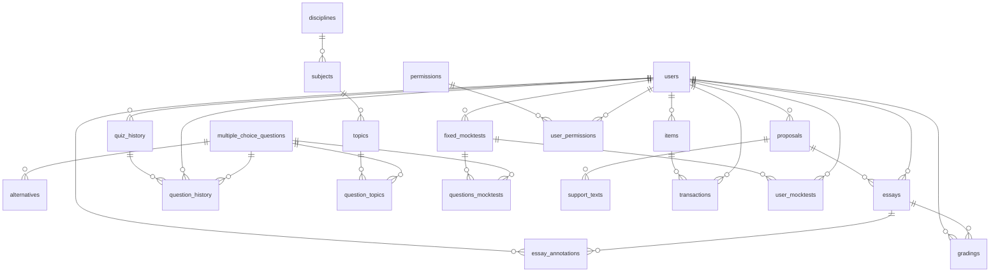
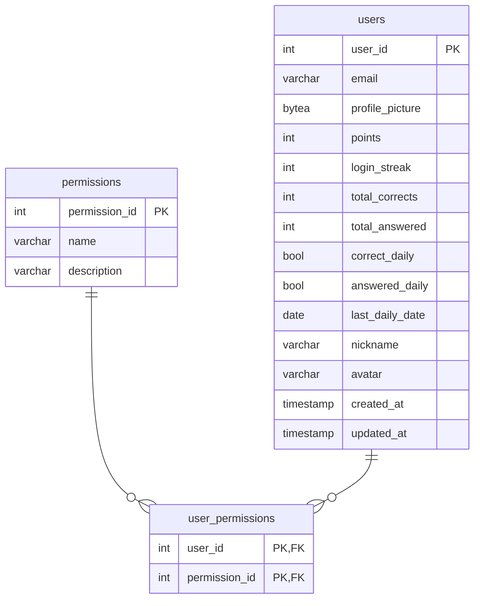
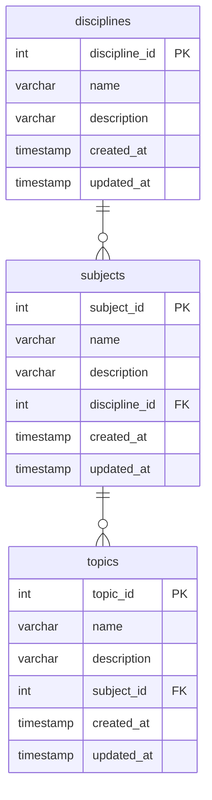
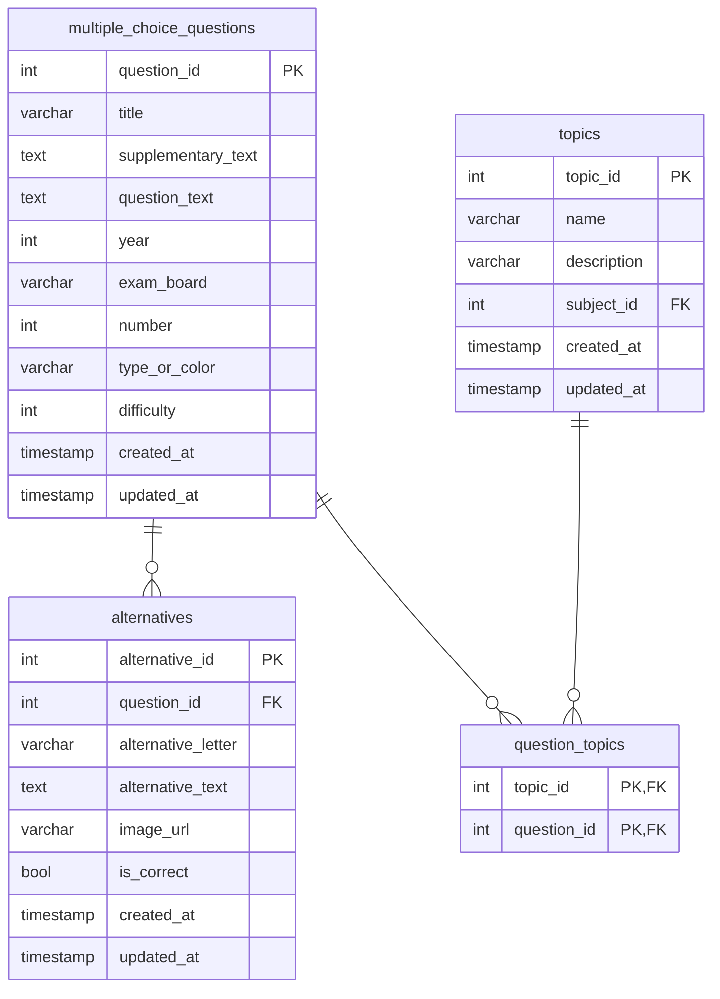
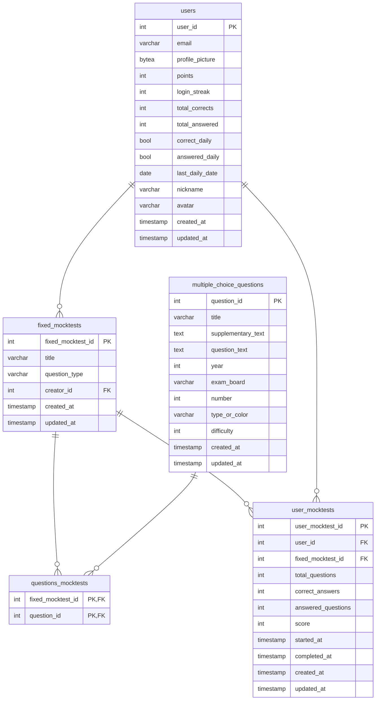
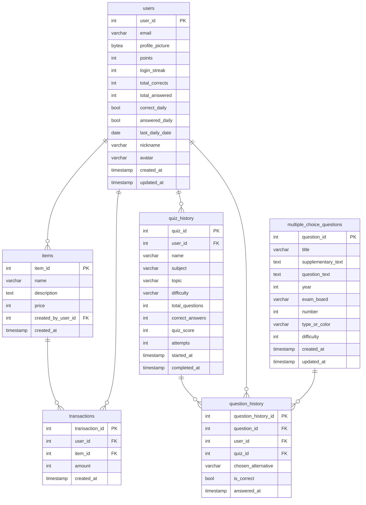
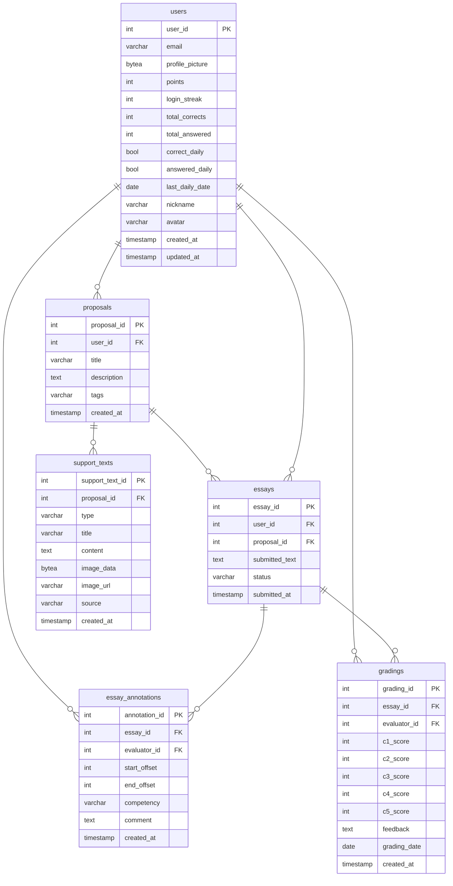
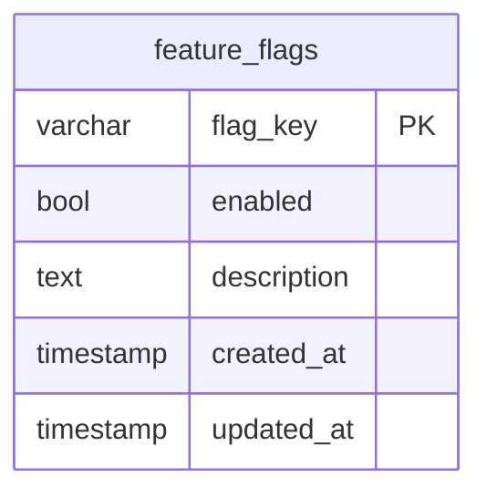

# Modelo de Dados

Esta página apresenta a estrutura do banco de dados do IFVest: as tabelas, suas colunas e os relacionamentos entre elas.

!!! info "Gerado a partir do código em produção"
    Os diagramas abaixo foram gerados **diretamente dos modelos do backend**, e não desenhados à mão. Isso garante que correspondem exatamente ao esquema em uso: **22 tabelas, 22 chaves primárias e 27 chaves estrangeiras** — os mesmos números registrados pela equipe ao verificar o banco de produção.

    Para regenerá-los após alterações nos modelos, ver [Como atualizar esta página](#como-atualizar-esta-pagina).

---

## Visão geral dos relacionamentos

O diagrama abaixo mostra apenas as tabelas e como se relacionam, sem as colunas. A tabela `feature_flags` não aparece por não ter relacionamento com as demais.

**Como ler o diagrama:** cada linha liga duas tabelas por uma chave estrangeira. O lado com duas barras (`||`) é a tabela referenciada; o lado com o círculo e o pé de galinha (`o{`) é a que guarda a referência — e que pode ter vários registros ligados a um mesmo registro do outro lado.

---

## Tabelas por domínio

Nas colunas, **PK** indica chave primária e **FK** indica chave estrangeira. Tabelas que aparecem em mais de um domínio estão repetidas para mostrar a ligação entre eles.

### Usuários e permissões

### Taxonomia

### Banco de questões

### Simulados

### Quiz e gamificação

### Redação

### Plataforma

---

## Pontos de atenção do modelo

**Taxonomia e questões.** As questões se vinculam **apenas a tópicos**, por meio da tabela associativa `question_topics`, que permite a uma mesma questão pertencer a vários tópicos. Disciplina e assunto não são gravados na questão: são obtidos percorrendo a árvore `topics → subjects → disciplines`.

**Imagens gravadas no banco.** As colunas `profile_picture`, em `users`, e `image_data`, em `support_texts` — os textos de apoio das propostas de redação —, guardam **o próprio arquivo** em formato binário (`bytea`). Já as imagens das questões ficam em disco, fora do banco. Ver [Arquitetura — Armazenamento de arquivos](arquitetura.md#armazenamento-de-arquivos).

**Dados de gamificação no usuário.** Pontuação, ofensiva diária e totais de acertos ficam como colunas da própria tabela `users`, e não em uma tabela separada.

---

## Como atualizar esta página

Os diagramas são gerados a partir dos metadados do SQLAlchemy. Após qualquer alteração nos modelos — que sempre é acompanhada de uma migration do Alembic —, eles devem ser regenerados para que esta página continue correspondendo ao banco.

⬜ *Pendente: disponibilizar o script de geração no repositório, para que a atualização possa ser feita por qualquer pessoa da equipe.*

---

## Fontes desta página

| Conteúdo | Fonte | Data |
|---|---|---|
| Tabelas, colunas, chaves e relacionamentos | Metadados dos modelos SQLAlchemy do `ifvest-monorepo` (`ifvest-backend/src/models/`) | set/2026 |
| Contagem de tabelas e chaves em produção | Documentação de implantação do repositório (`deploy/README.md`) | set/2026 |
