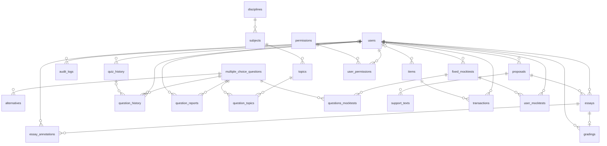
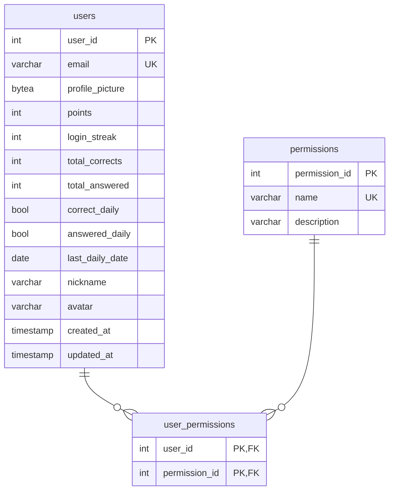
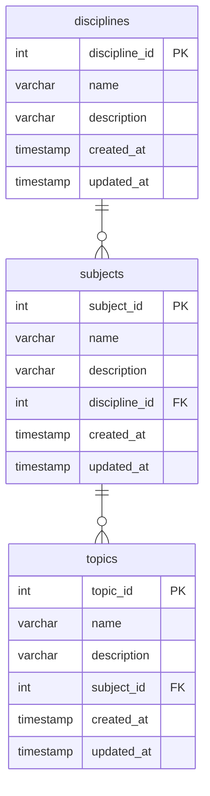
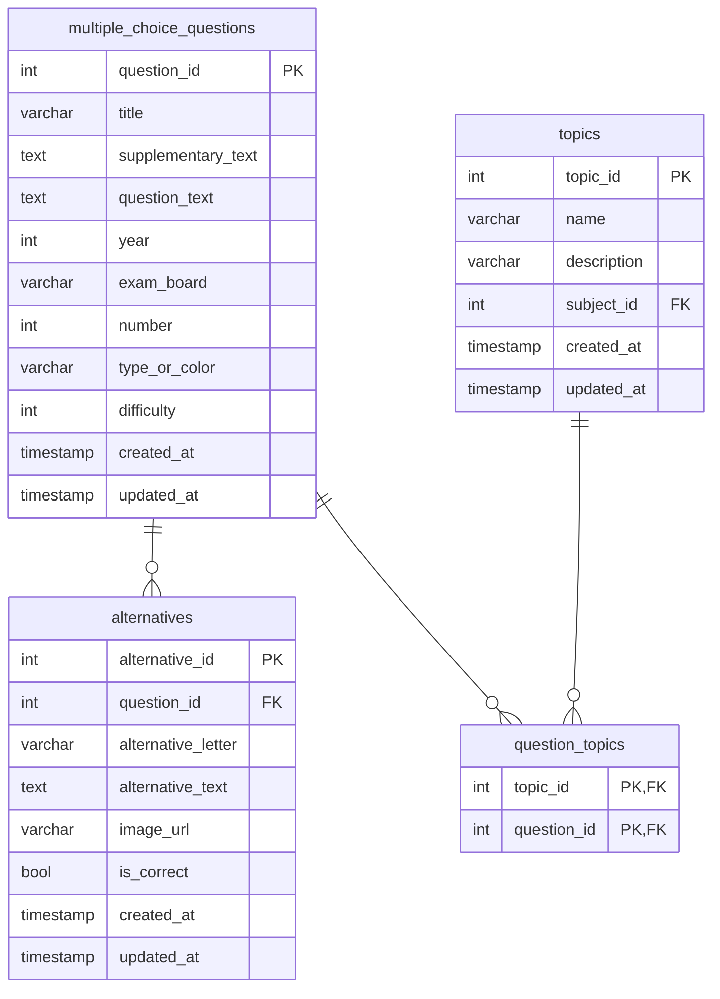
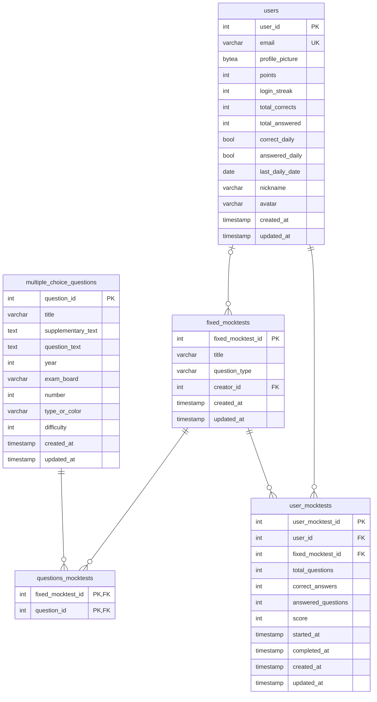
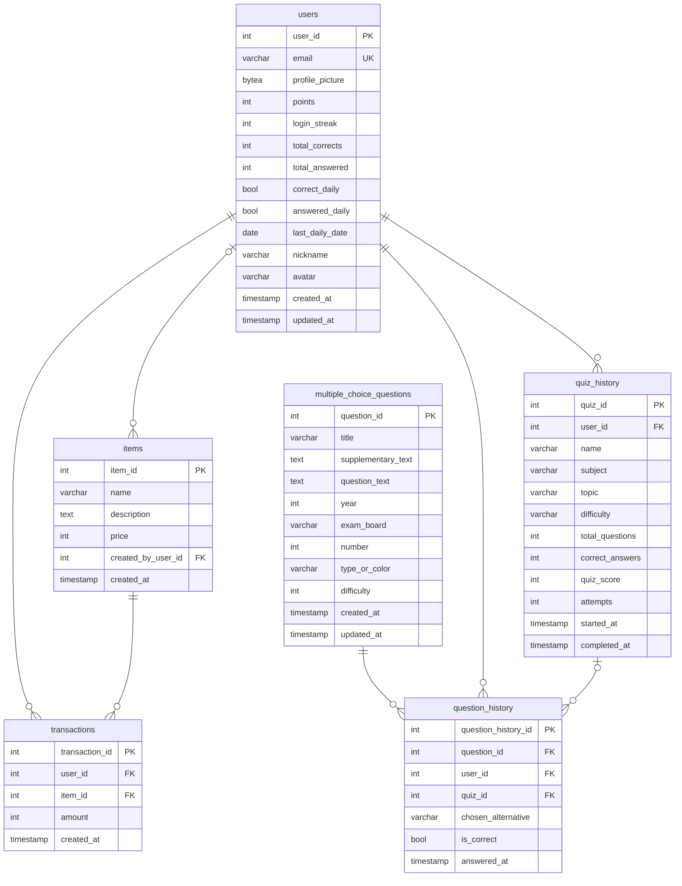
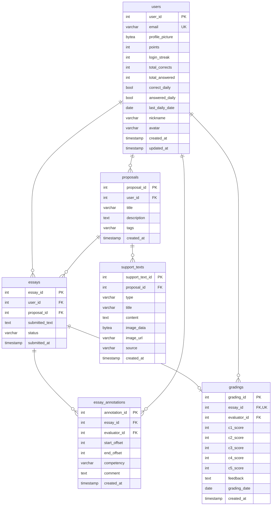
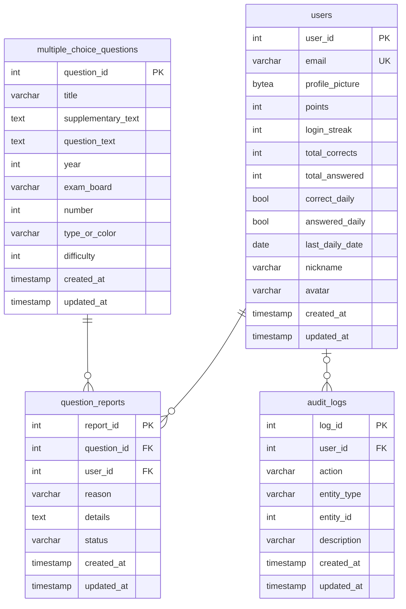
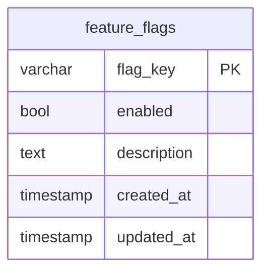

# Modelo de Dados

Esta página apresenta a estrutura do banco de dados do IFVest: as tabelas, suas colunas e os relacionamentos entre elas.

!!! info "Gerado a partir do código em produção"
    Os diagramas abaixo foram gerados **diretamente dos modelos do backend**, e não desenhados à mão. São as mesmas definições que o Alembic compara com o banco, o que garante que correspondem ao esquema em uso. Para regenerá-los após alterações nos modelos, ver [Como atualizar esta página](#como-atualizar-esta-pagina).

    Ao adotar o Alembic, a equipe conferiu o banco de produção e registrou **21 tabelas e 27 chaves estrangeiras**. As tabelas e chaves a mais que aparecem abaixo vieram das migrations seguintes: controle dos módulos (`feature_flags`), denúncias de questões (`question_reports`) e registro de auditoria (`audit_logs`).

---

<!-- INÍCIO do trecho gerado por scripts/gerar_modelo_de_dados.py: não edite à mão -->

## Visão geral dos relacionamentos

O esquema tem **24 tabelas** e **30 chaves estrangeiras**. O diagrama abaixo mostra apenas as tabelas e como se relacionam, sem as colunas. A tabela `feature_flags` não aparece por não ter relacionamento com as demais.



**Como ler o diagrama:** cada linha liga duas tabelas por uma chave estrangeira. Na ponta da tabela que guarda a referência, o círculo com o pé de galinha indica que vários registros dela podem apontar para um mesmo registro do outro lado, e o círculo com uma barra, que há no máximo um. Na ponta da tabela referenciada, as duas barras indicam que a referência é obrigatória, e o círculo com uma barra, que ela pode ficar vazia.

---

## Tabelas por domínio

Nas colunas, **PK** indica chave primária, **FK**, chave estrangeira, e **UK**, valor que não se repete na tabela. Tabelas que aparecem em mais de um domínio estão repetidas para mostrar a ligação entre eles.

### Usuários e permissões



### Taxonomia



### Banco de questões



### Simulados



### Quiz e gamificação



### Redação



### Moderação e auditoria



### Plataforma



<!-- FIM do trecho gerado -->

---

## Pontos de atenção do modelo

**Taxonomia e questões.** As questões se vinculam **apenas a tópicos**, por meio da tabela associativa `question_topics`, que permite a uma mesma questão pertencer a vários tópicos. Disciplina e assunto não são gravados na questão: são obtidos percorrendo a árvore `topics → subjects → disciplines`.

**Dificuldade das questões.** A coluna `difficulty` usa uma escala de 1 a 5, mas as provas da UNICAMP carregadas no banco não trazem essa informação na fonte, e a carga grava `2` quando ela falta. Por isso o valor ainda não representa a dificuldade real, e a montagem do quiz deixou de oferecer o filtro por dificuldade até que as questões sejam classificadas.

**Imagens gravadas no banco.** As colunas `profile_picture`, em `users`, e `image_data`, em `support_texts` — os textos de apoio das propostas de redação —, guardam **o próprio arquivo** em formato binário (`bytea`). Já as imagens das questões ficam em disco, fora do banco. Ver [Arquitetura — Armazenamento de arquivos](arquitetura.md#armazenamento-de-arquivos).

**Dados de gamificação no usuário.** O saldo de pontos, a sequência da Pergunta do Dia e os totais de acertos ficam como colunas da própria tabela `users`, e não em uma tabela separada. O saldo (`points`) diminui quando o estudante compra na loja; por isso o ranking não o usa, e soma os pontos ganhos nos quizzes (`quiz_history`) e nos acertos da Pergunta do Dia (`question_history`).

**Tentativas de simulado.** Cada envio grava uma linha em `user_mocktests`, com o total de questões, quantas foram respondidas, os acertos e a nota. As alternativas escolhidas em cada questão **não são guardadas**, e o início e o fim da tentativa são registrados no momento do envio, de modo que não medem o tempo de resolução.

**Uma correção por redação.** A coluna `essay_id` de `gradings` não se repete: cada redação recebe no máximo uma correção, e a API recusa uma segunda.

**Moderação e auditoria.** Uma denúncia (`question_reports`) fica `pending` até ser marcada como `resolved` ou `dismissed` por um administrador. O registro de auditoria (`audit_logs`) guarda quem cadastrou e editou questões, quem criou, editou e excluiu propostas de redação, quem concedeu e revogou permissões e quem alterou os módulos ativos. Se o autor de um registro for excluído, o registro permanece, sem a referência ao usuário.

---

## Como atualizar esta página

Os diagramas são produzidos pelo script `scripts/gerar_modelo_de_dados.py`, deste repositório, a partir dos metadados do SQLAlchemy. Após qualquer alteração nos modelos — que sempre acompanha uma migration do Alembic —, rode-o para que a página continue correspondendo ao banco. Com o monorepo clonado ao lado deste repositório:

```bash
py -m pip install --user -r ../ifvest-monorepo/ifvest-backend/requirements.txt
py scripts/gerar_modelo_de_dados.py ../ifvest-monorepo/ifvest-backend
```

O script lê os modelos sem conectar ao banco e substitui **apenas** o trecho entre os marcadores de início e fim; as seções escritas à mão, como esta, são preservadas. Se o backend ganhar uma tabela nova, ela aparece em "Sem domínio definido" até ser incluída no domínio certo, na lista `DOMINIOS` do próprio script.

---

## Fontes desta página

| Conteúdo | Fonte | Data |
|---|---|---|
| Tabelas, colunas, chaves e relacionamentos | Metadados dos modelos SQLAlchemy do `ifvest-monorepo` (`ifvest-backend/src/models/`), lidos pelo script de geração | set/2026 |
| Contagem registrada na adoção do Alembic | Documentação de implantação do repositório (`deploy/README.md`) | set/2026 |
| Tabelas criadas depois | Migrations do Alembic (`ifvest-backend/alembic/versions/`) | set/2026 |
| Dificuldade das questões | `docs/decisoes/0001-ocultar-seletor-de-dificuldade-do-quiz.md` e `docs/atualizar-questoes-na-vps.md` | set/2026 |
| Ranking e tentativas de simulado | `ifvest-backend/src/services/quiz_ranking.py` e `mocktests_service.py` | set/2026 |
