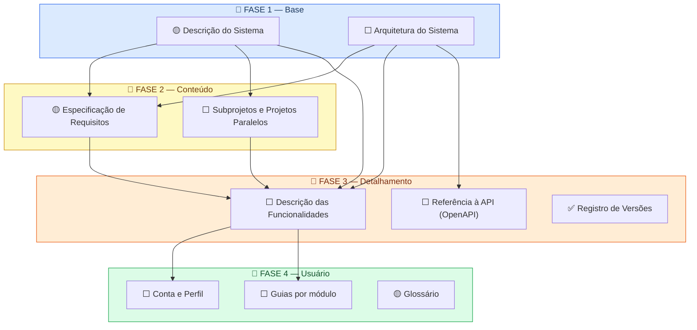

# Planejamento da Documentação

Este documento apresenta o mapeamento de toda a documentação a ser produzida para o projeto IFVest, organizando os itens por ordem de produção com base em suas dependências, e registrando as normas e os critérios adotados.

A ordem não é arbitrária — ela segue o princípio de que **você não consegue documentar algo que ainda não entendeu**. Para escrever como um usuário usa o sistema, você precisa antes saber o que o sistema faz. Para saber o que ele faz, você precisa antes entender como está construído. E assim por diante.

!!! danger "O IFVest está sendo substituído por uma nova plataforma"
    A partir de setembro de 2026, o IFVest passa a ser **uma plataforma nova**, desenvolvida do zero e referida internamente como **IFVest V3**. Ela substitui a versão anterior no mesmo endereço, com stack, modelo de dados e organização de perfis diferentes.

    Esta documentação passa a descrever **a plataforma nova**. O conteúdo produzido para a versão anterior permanece preservado no histórico do repositório, identificado pela etiqueta `legado-v2`, e sua trajetória fica registrada no [Registro de Versões](versoes.md).

    O que muda e o que permanece está detalhado em [O que a mudança de plataforma afeta](#o-que-a-mudanca-de-plataforma-afeta).

---

## O que está sendo documentado

O **IFVest V3** é uma aplicação educacional de apoio à preparação para o ENEM e vestibulares, com ferramentas de prática para estudantes e de gestão acadêmica para professores.

| | |
|---|---|
| **Frontend** | Next.js e React, hospedados na Vercel |
| **Backend** | Python com FastAPI, hospedado em VPS |
| **Banco de dados** | PostgreSQL |
| **Autenticação** | Firebase |
| **Infraestrutura local** | Docker Compose |

Duas características do domínio orientam toda a documentação:

- **Hierarquia de conteúdo** — todo material e questão obedece à estrutura **Disciplina → Assunto → Tópico**.
- **Permissões granulares (RBAC)** — o sistema não se apoia apenas nos cargos de aluno e professor: há uma camada de permissões específicas, atribuídas por administradores, que controlam ações individuais.

O escopo da primeira versão (MVP) contempla os módulos de **Redação**, **Quiz** e **Simulados**. **Revisão** e **Flashcards** estão previstos para versões seguintes.

---

## Legenda de Status

| Ícone | Status |
|-------|--------|
| ⬜ Pendente | Ainda não iniciado |
| 🟡 Em andamento | Em processo de produção |
| ✅ Concluído | Disponível na documentação |

Esta legenda indica o **andamento da produção de cada documento**. Dentro dos guias de usuário, os mesmos ícones aparecem com outro significado — o de indicar a situação de cada funcionalidade na plataforma —, conforme a legenda própria de cada guia.

---

## Diagrama de Dependências

O diagrama abaixo mostra as quatro fases da documentação e as dependências entre os itens. As setas indicam que um item depende do anterior para ser produzido.

---

## Fases em Detalhe

### 📘 Fase 1 — Base

!!! info "Por que vem primeiro?"
    Estes são os documentos fundacionais. Qualquer outro item da documentação depende de ter a visão geral do sistema e sua arquitetura claramente definidas. Sem isso, não é possível especificar requisitos, descrever funcionalidades nem orientar usuários.

| Item | Descrição | Status |
|------|-----------|--------|
| Descrição do Sistema | O que é o IFVest, qual problema resolve, quem usa, quais módulos existem e como o conteúdo e as permissões estão organizados. | 🟡 Em andamento |
| Arquitetura do Sistema | Como o sistema está organizado: frontend em Next.js, backend em FastAPI, banco PostgreSQL, autenticação Firebase e integrações externas. | ⬜ Pendente |

---

### 📙 Fase 2 — Conteúdo

!!! info "Por que vem em segundo?"
    Com a base definida, é possível registrar formalmente o que o sistema deve fazer e mapear o que está sendo desenvolvido pelas frentes de trabalho. Esses dois itens alimentam diretamente o detalhamento da fase seguinte.

| Item | Descrição | Status |
|------|-----------|--------|
| Especificação de Requisitos | Consolidação do que o sistema deve fazer (requisitos funcionais) e como deve se comportar (desempenho, acessibilidade, segurança). | 🟡 Em andamento |
| Subprojetos e Projetos Paralelos | Frentes de trabalho do projeto e produtos que se integram ao ecossistema, como o leitor de PDFs educacionais e o extrator de questões por IA. | ⬜ Pendente |

---

### 📒 Fase 3 — Detalhamento

!!! info "Por que vem em terceiro?"
    Com sistema, arquitetura e requisitos documentados, é possível detalhar cada funcionalidade, referenciar a documentação de API e registrar o histórico de mudanças. Estes itens são a ponte entre a estrutura técnica e o uso do sistema.

| Item | Descrição | Status |
|------|-----------|--------|
| Descrição das Funcionalidades | O que cada módulo faz — Redação, Quiz e Simulados no MVP; Revisão e Flashcards nas versões seguintes. | ⬜ Pendente — depende da entrega do MVP |
| Referência à API (OpenAPI) | Link para a especificação OpenAPI gerada pelo backend, sem duplicação de conteúdo. | ⬜ Pendente |
| Registro de Versões | Histórico das mudanças relevantes na plataforma, incluindo a transição da versão anterior para o IFVest V3. | ✅ Concluído |

---

### 📗 Fase 4 — Usuário

!!! info "Por que vem por último?"
    A documentação de usuário só pode ser produzida quando as funcionalidades estão descritas e os requisitos consolidados. Só então é possível escrever guias de uso precisos e completos.

    A referência à API **não é pré-requisito** desta fase: ela documenta o sistema para quem desenvolve, enquanto os guias documentam o uso da plataforma para quem estuda e ensina. As duas seguem em paralelo.

!!! warning "Os guias dependem da interface entregue"
    O desenho da interface do IFVest V3 é produzido por uma frente dedicada de design. Os guias de usuário só podem ser finalizados quando as telas estiverem implementadas, sob pena de descreverem uma interface que ainda pode mudar.

    Até lá, o material de design serve de base para a **camada de interface** de cada tarefa, sempre identificada como tal e com a fonte citada (ver [Separação entre o estado atual e o estado previsto](#separacao-entre-o-estado-atual-e-o-estado-previsto)).

| Item | Descrição | Status |
|------|-----------|--------|
| Conta e Perfil | Tarefas comuns a todos os perfis: criar conta, entrar, editar dados e excluir a conta. Seção única, referenciada pelos demais guias. | ⬜ Pendente |
| Guias por módulo | Passo a passo das ações de cada módulo, organizadas por objetivo do usuário e com indicação da permissão exigida, quando houver. | ⬜ Pendente |
| Glossário | Termos da plataforma e explicação de como os conteúdos e as permissões estão organizados. | 🟡 Em andamento |

!!! note "A estrutura dos guias acompanha o modelo de permissões"
    A versão anterior separava os guias por cargo — um para o aluno, outro para o professor. Como o IFVest V3 adota **permissões granulares** sobre os cargos, a organização por perfil deixa de ser suficiente: uma mesma tarefa pode estar disponível a usuários diferentes conforme as permissões que possuem.

    Os guias passam, portanto, a se organizar **por módulo e por tarefa**, indicando em cada uma a permissão exigida. ⬜ *A validar com o projeto conforme o modelo de permissões se consolidar.*

---

## O que a mudança de plataforma afeta

A substituição da plataforma não descarta a documentação já produzida. O que se mantém é o que descreve o **propósito** do sistema; o que se refaz é o que descreve sua **construção**.

| Item | Situação |
|---|---|
| Descrição do Sistema | Aproveitada em grande parte — mudam os módulos, a hierarquia de conteúdo e a organização de perfis |
| Especificação de Requisitos | Aproveitada em grande parte — entram as permissões granulares e o módulo de Redação |
| Diagrama C4 de Contexto | Aproveitado com ajustes |
| Diagramas C4 de Contêineres e Componentes | Refeitos — descrevem uma estrutura que deixa de existir |
| Arquitetura do Sistema | Refeita — a stack é outra |
| Descrição das Funcionalidades | Refeita — derivada do código da versão anterior |
| Guias de Uso | Refeitos, reaproveitando o material de design da frente de interface |
| Registro de Versões | Preservado e ampliado — a transição passa a fazer parte do histórico |
| Glossário | Aproveitado em parte — a hierarquia de conteúdo mudou de ordem |
| Normas, critérios e método | Integralmente preservados |

!!! note "Uma condição diferente, e melhor"
    A documentação da versão anterior foi produzida **anos depois** do sistema, por leitura de código e de relatórios. A do IFVest V3 é produzida **junto com o desenvolvimento**, com acesso às decisões enquanto são tomadas.

    Isso desloca o principal risco: deixa de ser a reconstrução de conhecimento perdido e passa a ser o acompanhamento de um sistema em construção acelerada. Os critérios registrados abaixo — evidência confirmada, separação de camadas e registro de divergências — respondem a esse risco.

---

## Como a documentação é produzida

A ordem das fases responde *o que* documentar primeiro. Esta seção registra *como* cada item é produzido — os critérios aplicados de forma uniforme em toda a documentação.

### Critério de evidência

**Nada é documentado sem fonte confirmada.** Cada informação registrada tem origem rastreável em uma destas fontes:

| Fonte | Uso |
|---|---|
| Código-fonte dos repositórios | Comportamento implementado: rotas, modelos de dados, validações e regras de acesso |
| Documento de onboarding e decisões de projeto | Escopo, stack, regras de negócio e definições acordadas pela equipe |
| Material da frente de design | Interface prevista de cada módulo |
| Especificação OpenAPI | Contrato da API entre backend e frontend |
| Registros de reunião | Decisões que alteram escopo, atribuições ou funcionamento |

Quando uma informação não pode ser confirmada, ela **não é inferida**: registra-se uma pendência explícita no lugar, indicando o que falta e com quem esclarecer.

### Separação entre o estado atual e o estado previsto

O sistema é documentado enquanto está sendo construído. Por isso, cada informação é classificada em uma de duas camadas:

- **Camada estável** — objetivo, pré-requisitos e sequência de passos de cada tarefa. Descreve o que o usuário faz, não a tela em que faz, e por isso sobrevive a mudanças de interface.
- **Camada de interface** — telas, botões e caminhos de navegação. É a parte volátil, e por isso aparece sempre identificada como prevista, com a fonte citada e a ressalva de que o design pode mudar.

Essa separação é o que permite produzir documentação útil antes da entrega das funcionalidades, sem produzir material descartável.

### Registro de divergências

Quando duas fontes se contradizem — por exemplo, um documento de projeto descrevendo um comportamento e o código implementando outro —, a divergência é **registrada na própria página**, com a indicação de qual fonte foi adotada e por quê. Divergências não são resolvidas silenciosamente.

### Formato e publicação

A documentação é produzida em formato **docs-as-code**: o conteúdo é escrito em Markdown, versionado em repositório Git e mantido junto ao projeto, o que permite revisar alterações, recuperar versões anteriores e atualizar documentação e software no mesmo fluxo de trabalho.

A publicação utiliza o **MkDocs** com o tema Material, que converte os arquivos-fonte em um site navegável com busca e sumário. Os diagramas de arquitetura são igualmente descritos em texto, com **PlantUML**, e renderizados na geração do site.

---

## Norma de referência

Esta estrutura foi definida com base na **ISO/IEC/IEEE 15289:2019** — norma internacional que especifica o conteúdo mínimo dos itens de documentação ao longo do ciclo de vida de sistemas de software —, complementada por:

- **ISO/IEC/IEEE 12207:2017** — *Software life cycle processes*. Estabelece a documentação como parte integrante do ciclo de vida do software, e não como produto separado. É a norma cujos processos a 15289 mapeia.
- **ISO/IEC/IEEE 26514:2022** — *Design and development of information for users*. Orienta a estrutura e o conteúdo da documentação de usuário produzida na Fase 4.

As três normas permitem **adaptação ao contexto do projeto**, desde que a seleção dos itens produzidos e omitidos seja registrada — o que este documento faz.

---

## Resumindo

O IFVest será considerado documentado quando qualquer pessoa de fora conseguir responder, apenas lendo esta documentação:

**O que é este sistema? Como ele está construído? O que ele faz? O que ele deve fazer? Como eu uso? O que mudou até agora?**
