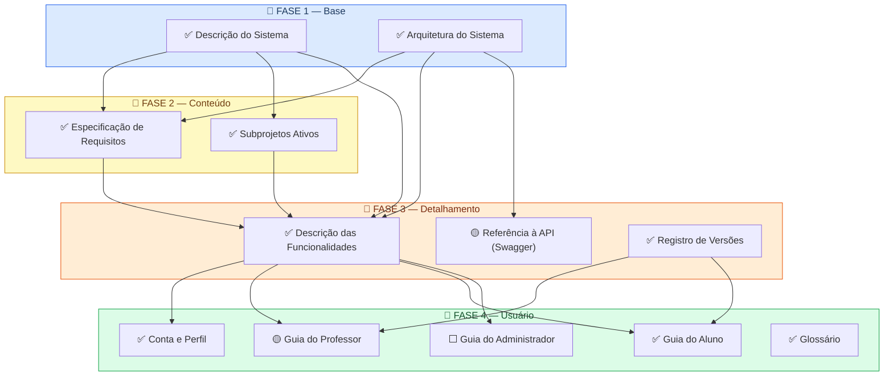

# Planejamento da Documentação

Este documento apresenta o mapeamento visual de toda a documentação a ser produzida para o projeto IFVest, organizando os itens por ordem de produção com base em suas dependências.

A ordem não é arbitrária — ela segue o princípio de que **você não consegue documentar algo que ainda não entendeu**. Para escrever como um usuário usa o sistema, você precisa antes saber o que o sistema faz. Para saber o que ele faz, você precisa antes entender como está construído. E assim por diante.

!!! warning "Sobre o estado da plataforma refletido nesta documentação"
    As **Fases 1 a 3** desta documentação — descrição do sistema, arquitetura,
    requisitos, funcionalidades e histórico de versões — foram produzidas a partir
    das fontes disponíveis até então: os TCCs de 2021 e 2024, os relatórios de
    extensão de 2024–2025 e o código-fonte do repositório, cujo último estado
    disponível não acompanha as refatorações em curso. Elas descrevem, portanto,
    **a plataforma anterior à refatoração**.

    Enquanto essa documentação era produzida, diversos subprojetos passaram a
    refatorar a plataforma simultaneamente — com destaque para a migração do
    frontend para React e o redesign completo da interface. Isso significa que
    partes das Fases 1 a 3 descrevem um estado que está sendo substituído.

    Por orientação do projeto, a **Fase 4** é a primeira produzida tendo a
    **plataforma refatorada como referência**, e não o estado transitório atual.
    Os guias de usuário separam explicitamente o que é verificável hoje do que
    está previsto no redesign, citando a fonte de cada informação futura — ver
    [Guia do Aluno](guias/aluno/index.md).

    A revisão das fases anteriores não foi feita ainda porque a refatoração
    também não está concluída: revisá-las agora, contra um alvo em movimento,
    reproduziria o mesmo problema. **Concluída a Fase 4 e entregues as
    refatorações, a documentação será revisada desde a Fase 1**, com o mesmo
    critério adotado na Fase 4 — corrigindo e atualizando o que não corresponder
    à plataforma refatorada. Divergências já identificadas entre as fontes ficam
    registradas nas próprias páginas até essa revisão.

---

## Legenda de Status

| Ícone | Status |
|-------|--------|
| ⬜ Pendente | Ainda não iniciado |
| 🟡 Em andamento | Em processo de produção |
| ✅ Concluído | Disponível na documentação |

Esta legenda indica o **andamento da produção de cada documento**. Dentro dos guias de usuário, os mesmos ícones aparecem com outro significado — o de indicar a situação de cada funcionalidade na plataforma —, conforme a legenda própria de cada guia.

---

## Diagrama de Dependências

O diagrama abaixo mostra as quatro fases da documentação e as dependências entre os itens. As setas indicam que um item depende do anterior para ser produzido.

---

## Fases em Detalhe

### 📘 Fase 1 — Base

!!! info "Por que vem primeiro?"
    Estes são os documentos fundacionais. Qualquer outro item da documentação depende de ter a visão geral do sistema e sua arquitetura claramente definidas. Sem isso, não é possível especificar requisitos, descrever funcionalidades nem orientar usuários.

| Item | Descrição | Status |
|------|-----------|--------|
| Descrição do Sistema | O que é o IFVest, qual problema resolve, quem usa, quais funcionalidades existem e quais tecnologias compõem o sistema. | ✅ Concluído |
| Arquitetura do Sistema | Como o sistema está organizado internamente: frontend, backend, banco de dados e integrações com APIs externas (ENEM, FUVEST). | ✅ Concluído |

---

### 📙 Fase 2 — Conteúdo

!!! info "Por que vem em segundo?"
    Com a base definida, é possível registrar formalmente o que o sistema deve fazer e mapear o que está sendo desenvolvido pelos subprojetos. Esses dois itens alimentam diretamente o detalhamento da fase seguinte.

| Item | Descrição | Status |
|------|-----------|--------|
| Especificação de Requisitos | Consolidação do que o sistema deve fazer (requisitos funcionais) e como deve se comportar (desempenho, acessibilidade, segurança). | ✅ Concluído |
| Subprojetos Ativos | Descrição dos projetos vinculados ao IFVest e seu estado atual: migração para React, correção de redações, LGPD, sistema de recomendação, entre outros. | ✅ Concluído |

---

### 📒 Fase 3 — Detalhamento

!!! info "Por que vem em terceiro?"
    Com sistema, arquitetura e requisitos documentados, é possível detalhar cada funcionalidade existente, referenciar a documentação de API e registrar o histórico de mudanças. Estes itens são a ponte entre a estrutura técnica e o uso do sistema.

| Item | Descrição | Status |
|------|-----------|--------|
| Descrição das Funcionalidades | O que cada funcionalidade da plataforma faz: autenticação e perfil, Revisão de Conteúdo, IFQuiz, Flashcards, Simulados e banco de questões, tanto no perfil de aluno quanto no de professor. | ✅ Concluído |
| Referência à API (Swagger) | Link e orientações para a documentação de API gerada pela equipe de backend via Swagger/OpenAPI. Sem duplicação de conteúdo. | 🟡 Em andamento |
| Registro de Versões | Histórico das mudanças relevantes na plataforma: funcionalidades adicionadas, modificadas ou removidas ao longo do projeto. | ✅ Concluído |

---

### 📗 Fase 4 — Usuário

!!! info "Por que vem por último?"
    A documentação de usuário só pode ser produzida quando todas as funcionalidades estão descritas e os requisitos consolidados. Só então é possível escrever guias de uso precisos e completos.

    A referência à API **não é pré-requisito** desta fase: ela documenta o sistema para quem desenvolve, enquanto os guias documentam o uso da plataforma para quem estuda e ensina. As duas seguem em paralelo.

!!! warning "A divisão de perfis está em definição"
    O redesign prevê um **perfil de administrador**, que assumirá parte das tarefas hoje atribuídas ao professor. Enquanto essa redistribuição não é concluída, o Guia do Professor marca cada tarefa com o perfil a que pertence, de modo que as tarefas realocadas possam migrar para o Guia do Administrador sem reescrita.

| Item | Descrição | Status |
|------|-----------|--------|
| Conta e Perfil | Tarefas comuns a todos os perfis: criar conta, entrar, recuperar acesso, editar dados e excluir a conta. Seção única, referenciada pelos demais guias. | ✅ Concluído |
| Guia do Aluno | Passo a passo das ações de estudo: ler materiais de revisão, estudar flashcards, realizar simulados e jogar o IFQuiz. | ✅ Concluído |
| Guia do Professor | Passo a passo da criação e gestão de conteúdo: banco de questões, simulados, flashcards e materiais de revisão. | 🟡 Em andamento |
| Guia do Administrador | Tarefas do perfil de administrador previsto no redesign, incluindo a organização de conteúdos e o acompanhamento de alterações. | ⬜ Pendente |
| Glossário | Termos da plataforma e explicação de como os conteúdos são organizados. Compartilhado por todos os guias. | ✅ Concluído |

---

## Como a documentação é produzida

A ordem das fases responde *o que* documentar primeiro. Esta seção registra *como* cada item é produzido — os critérios aplicados de forma uniforme em toda a documentação.

### Critério de evidência

**Nada é documentado sem fonte confirmada.** Cada informação registrada tem origem rastreável em uma destas fontes:

| Fonte | Uso |
|---|---|
| Código-fonte do repositório | Comportamento atual da plataforma: rotas, validações, regras de acesso e efeitos de exclusão |
| Relatórios dos subprojetos | Interface e funcionalidades previstas na refatoração, sempre com indicação do relatório e da figura |
| Atas de reunião | Decisões do projeto que alteram escopo, atribuições ou funcionamento |
| Trabalhos de conclusão de curso | Histórico do sistema e das versões anteriores |

Quando uma informação não pode ser confirmada, ela **não é inferida**: registra-se uma pendência explícita no lugar, indicando o que falta e com quem esclarecer.

### Separação entre o estado atual e o estado previsto

Como a plataforma está sendo refatorada enquanto a documentação é produzida, cada informação é classificada em uma de duas camadas:

- **Camada estável** — objetivo, pré-requisitos e sequência de passos de cada tarefa. Verificável hoje e válida após a refatoração, porque descreve o que o usuário faz, não a tela em que faz.
- **Camada de interface** — telas, botões e caminhos de navegação. É a parte que a refatoração substitui, e por isso aparece sempre identificada como referente à versão refatorada, com a fonte citada e a ressalva de que o design pode mudar.

Essa separação é o que permite produzir documentação útil antes da entrega da refatoração, sem produzir material descartável.

### Registro de divergências

Quando duas fontes se contradizem — por exemplo, o código descrevendo um comportamento e um relatório de subprojeto observando outro na plataforma em uso —, a divergência é **registrada na própria página**, com a indicação de qual fonte foi adotada e por quê. Divergências não são resolvidas silenciosamente.

### Formato e publicação

A documentação é produzida em formato **docs-as-code**: o conteúdo é escrito em Markdown, versionado em repositório Git e mantido junto ao projeto, o que permite revisar alterações, recuperar versões anteriores e atualizar documentação e software no mesmo fluxo de trabalho.

A publicação utiliza o **MkDocs** com o tema Material, que converte os arquivos-fonte em um site navegável com busca e sumário. Os diagramas de arquitetura são igualmente descritos em texto, com **PlantUML**, e renderizados na geração do site.

---

## Norma de referência

Esta estrutura foi definida com base na **ISO/IEC/IEEE 15289:2019** — norma internacional que especifica o conteúdo mínimo dos itens de documentação ao longo do ciclo de vida de sistemas de software —, complementada por:

- **ISO/IEC/IEEE 12207:2017** — *Software life cycle processes*. Estabelece a documentação como parte integrante do ciclo de vida do software, e não como produto separado. É a norma cujos processos a 15289 mapeia.
- **ISO/IEC/IEEE 26514:2022** — *Design and development of information for users*. Orienta a estrutura e o conteúdo da documentação de usuário produzida na Fase 4.

As três normas permitem **adaptação ao contexto do projeto**, desde que a seleção dos itens produzidos e omitidos seja registrada — o que este documento faz.

!!! tip "Resumindo em uma frase"
    O IFVest estará documentado quando qualquer pessoa de fora conseguir responder, só lendo esta documentação: *O que é esse sistema? Como está construído? O que faz? Como eu uso? O que deve fazer? O que mudou até agora?*

